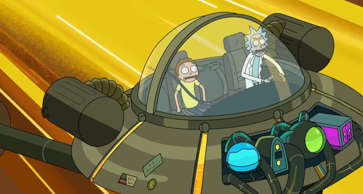
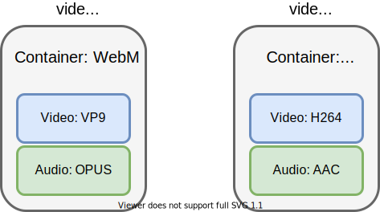
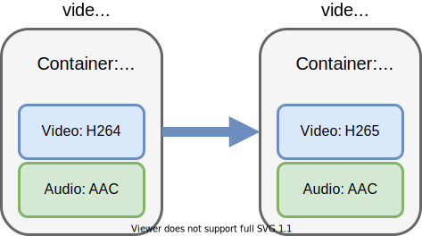
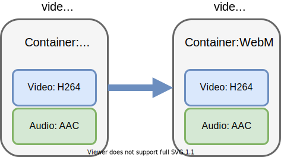
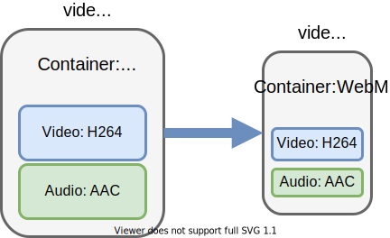

import { Youtube } from '../../../src/components/youtube';
import { ToC, BottomNav } from './components/toc';

<ToC current="what-is-video" />

A video is nothing more than a sequence of images. You may remember something like this from your childhood:

The basic idea is that, starting a given frequency (or framerate), the quick transition between images becomes
indistinguishable from movement.

So the problem of digitally storing and reproducing video boils down to the ability of storing individual images, and
being able to play them very quickly.
As we'll see though, this analogy dies out very quickly when looking at possible implementations.

Take a very simple image, such as this actual screenshot I took from a recent [Rick and Morty](https://www.imdb.com/title/tt2861424/) episode:

This image file is 72KB. If every frame of a video was that big, then the entire 20-minute long video, running at a standard 24 frames-per-second, we'd have:

$$
72_{KB} * 60_{seconds} * 24_{fps} ~= 1.97_{GB}
$$

Now, keep in mind this is a screenshot that was already scaled down to around 600x321 of resolution. 2GB is more along
the lines what I'd expect for an hour-long 1080p video. And we're not even counting audio tracks here.

Image compression is a [whole area off its own](https://en.wikipedia.org/wiki/Lossless_compression), and the screenshot
in question already went through a compression algorithm, so we won't be looking too much into that here.
And clearly there must be some clever engineering going on here to optimize compression even more. And that's where Codecs
come in

## What's a codec?

> A video codec is an electronic circuit or software that compresses or decompresses video - [Wikipedia](https://en.wikipedia.org/wiki/Video_codec)

"Codec" stands for "enCOder/DECoder" (and if you're wondering, that seemingly arbitrary mixing of two words also has a name:
[portmanteau](https://en.wikipedia.org/wiki/Portmanteau))

A codec is the software that will both encode a raw stream for efficient storage, as well as decode streams of
a compatible format while reproducing a video.

When you watch a video, a codec is running in the background, continously reading from a video file, and essentially
reverse-engineering all the frames, quickly enough for you to enjoy those 60fps 4k moderns videos of Costa Rica's
wilderness.

<Youtube videoID="LXb3EKWsInQ" />

*And the more you know about how this stuff works, the more crazy it is to see it actually working. Damn, computers are
fast.*

Codecs exist in huge variety. You can have different rates compression, encoding performances, image quality, etc. As
such, some codecs might be more suited for real-time usage, such as [Twitch](https://twitch.tv), while others might be
better for long-term lossless storage.

## Container formats

Containers are wrapper formats that hold the multiple streams needed to form a movie (because it's not just video.
Audio, and even subtitles are represented as streams within the same file as well).

A container is the file extension you'll actually see. The format works much like a Zip file, archiving multiple smaller
files (or streams, in this case) in a single file.

This means that, as you can see in the image above, MPEG and MP4 are not video codecs, but simply container formats. This is often a source of confusion.

This also makes it so that of **converting** a video can mean a multitude of things:

### Transcoding

The act of converting from one codec to another, while keeping all other streams, and the same container format

### Transmuxing

The act of converting the container format while keeping the same underlying streams encoded with the same codecs as
before

### Transrating

The act of changing the bit rate of a video (e.g.: to reduce its overall size, and make it transferrable over slower mediums).

Now let's take a short detour to talk about audio as well in the [next section](/ffmpeg-rust-tutorial/what-is-audio).

<BottomNav current="what-is-video" />
