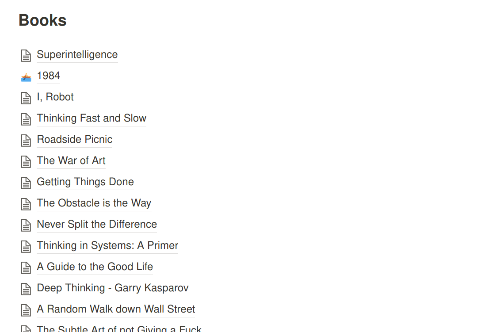
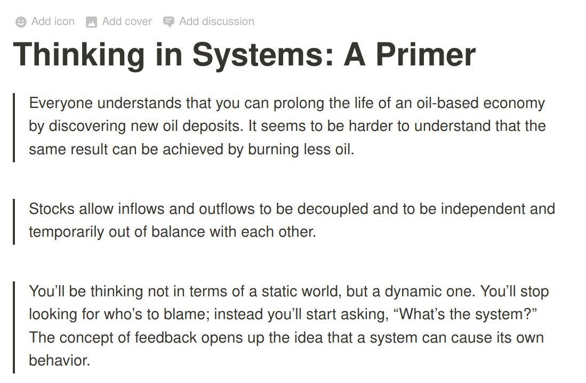

+++
title="A knowledge base with Vim, Fzf and Ripgrep"
slug="knowledge-base"
date=2020-07-27
category="linux"

[extra]
seo_image = "twitter-card.png"
+++

[learning-machine]: https://superorganizers.substack.com/p/how-to-build-a-learning-machine
[sirupsen-zk]: https://github.com/sirupsen/zk
[zk]: https://github.com/naps62/zk
[audible]: https://www.audible.com
[feedly]: https://feedly.com
[pocket]: https://app.getpocket.com
[todoist]: https://todoist.com
[spaced-repetition]: https://en.wikipedia.org/wiki/Spaced_repetition
[notion]: https://notion.so
[zk-wiki]: https://en.wikipedia.org/wiki/Zettelkasten
[superintelligence]: https://www.goodreads.com/book/show/20527133-superintelligence
[ripgrep]: https://github.com/BurntSushi/ripgrep
[twitter]: https://twitter.com/naps62

I've been trying to grow my own knowledge base for a long time now, by keeping
track of multiple notes taken from books, quotes, and other sources of
knowledge.

Now, and after a few iterations, I'm moving that to a more Unix-oriented
approach, which I'm presenting here

**TL;DR: I built my own terminal-based Zettelkasten system. Checkout the
Readme and source code [at Github][zk]**

## My sources

I'm both the worst person at note taking, and the kind of person that needs
note-taking the most. My memory sucks, but so does my caligraphy

Like most other people, I consume information from several different sources. Here's a few:

- Throughout my work (google searches, stack overflow, conversations, etc)
- Books, which I mostly consume with my Kindle, and sometimes [Audible][audible]
- Articles (via both [Feedly][feedly] and [Pocket][pocket])
- Podcasts

You may notice that I'm very digital-oriented. I do that both as a way to live 
a more minimalistic lifestyle (less physical items + easier to travel), but also
to be able to retrieve information more easily.

Using my Kindle allows me to highlight any quote I want to save for later. Same
goes for my news feeds.  Audible also has a clipping feature, although it's
a bit more awkward to use, and doesn't provide any kind of programatic access to
text. For more ad-hoc situations, such as a conversation, a quick note on
[Todoist][todoist] also works really well.

Throughout my day, I want the ability to quickly highlight pieces of
information, with the least amount of friction possible.

Periodically, usually at the end of each month, I'll go through all new notes,
and organize them into my own knowledge base, with two main goals in mind:

1. To condense any potentially useful knowledge in an accessible way
2. To go through everything a second time (or more), to consolidate knowledge.

Whenever I, later on, want to remind myself of a particular concept, or even
find a particular quote or definition to include in a talk I'm building, I'll
often go back to this knowledge base.  I'll also make a point to revisit notes
for a particular book at some point in the future, doing a slightly informal
  version of [Spaced
  Repetition][spaced-repetition]

So here's how I built this knowledge base:

## First draft: Notion

My first version of this knowledge base was built with
[Notion][notion].

Notion is a text editor with superpowers. It allows me to create whatever
hierarchy I want. It supports full-text search. And works on all platforms
without any extra effort, meaning I can have my knowledge available at all
times.

I can create a page for each book I read:



And within those pages, I can use a markdown-like syntax to list highlights:



But this didn't fit my own workflow very easily.

I'm a long-time linux user, and I've come to learn how to be productive with
tools that I have available on my terminal. So it made sense to me that my
knowledge base should be accessible on my terminal as well, and taking advantage
of the tools that I already know and love.

This also allowed me to build some custom features that I've been wanting for
some time.

Which is why I build my own zettelkasten setup.

## A Zettelkasten

> a knowledge management and note-taking method used in research and study

*[Wikipedia][zk-wiki]*

I've actually only learned of this name recently, when reading [a blog
post][learning-machine] that ended up being one of the inspirations for this
work.

A zettelkasten is a personal knowledge base. The name is of german origin,
"Zettel" meaning note, and "Kasten" meaning box.

It's not a concrete methodology, or a specific way of organizing information.
It's nothing more than a metaphorical box of notes.

## A unix-based zettelkasten

To this end, I ended up building my own set of scripts to manage a knowledge
base, by stitching together multiple tools that are already part of my daily
workflow.

### Notes as markdown

Each note is represented as a single markdown file.

Markdown is intuitive enough to use in the context of a terminal, and syntax
highglighting allows me to leverage it for a few extra things, as we'll see

Here's an example of a real note from my knowledge base:

```markdown
# Recalcitrance

Resistance towards helpfulness or evolution

https://www.dictionary.com/browse/recalcitrance

@superintelligence @nick-bostrom @book
#definition #ai
```

This is a short one. A definition of a word. One that I learned while reading
[Superintelligence][superintelligence]
a few years ago.

I chose to use hashtags, such as `#definition` to tag each note as I see fit,
but also to specify sources using `@`.

This allows me build tooling to search for both tags and sources, and quickly
find what I'm looking for.

This note is also not static. If I come back to it, I'm free to edit it as I see
fit, or even add new tags, if I want to relate it with some newfound idea
present somewhere else in the base.

### See it in action

Here's a quick rundown of what I have so far:

1. The knowledge base is pointed to by `$ZK_PATH`;
2. `zk new <title>` creates a new note;
3. `zk tags` starts an interactive fuzzy search across all existing tags;
4. `zk sources` does the same thing, but for sources instead;
5. `zk search` starts a full text search on the entire knowledge base.


PS: As I mentioned, most of this is inspired by [this
article][learning-machine]. The author [built and open-sourced][sirupsen-zk] his
own system using very similar tools as the ones I did.

Curious about what's underneath all this? It's actually fairly simple:

#### Git

The knowledge base itself is a `git` repo. Assuming you're a developer (or
similar role), this should not require any further explanation. 😄

#### Vim

My editor of choice. Since this is, at the moment, made for personal use,
I haven't focused on supporting anything else, as I have no need for it

#### Ripgrep

Remember what I said about searching for tags or sources?

[`ripgrep`][ripgrep] is an extremely fast full-text search tool.

I can build a searh for tags (words starting with `#`) with something like the
following:

```sh
rg --only-matching "#[\w\-_]{3,}" --type md ...
```

#### Fzf

Fzf is a fuzzy-finder which, when coupled with ripgrep, provides a great
interactive and real-time search environment right in my terminal

## Wrapping up

This system is still in its early stages (in fact, I'm still in the process of
migrating some notes from Notion).
It does look very promising though, since I find myself using it a lot more
often just because it sits right there in my terminal.

Check out the source code on [github][zk], or [let me know][twitter] your
thoughts about all this. 👋
