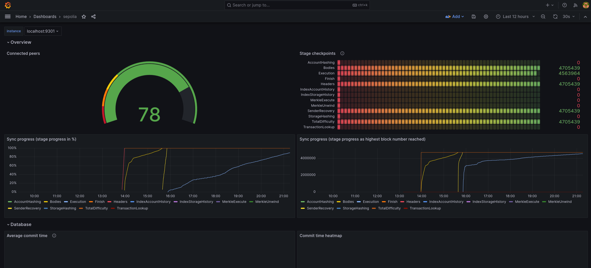

+++
title="Ethereum node setup with Reth & Systemd"
slug="eth-node-with-reth-systemd"
date=2023-11-16
category="ethereum"
+++

[reth]: https://paradigmxyz.github.io/reth/intro.html
[lighthouse]: https://lighthouse.sigmaprime.io/
[prometheus]: https://prometheus.io/
[grafana]: https://grafana.com/
[checkpoints]: https://eth-clients.github.io/checkpoint-sync-endpoints/#mainnet

This is the guide I wish I had 2 days ago.

I needed to setup my own Ethereum testnet node, for development purposes. This is something I've done before, but always in a haphazard way.

Today I wanted to _get it right_.

Instead of going the usual route of setting up a `docker-compose.yml`, I want to keep it even simpler and rely on something I already use everyday: `systemd`, the service manager for Arch-based distros.

My goal is to run a full Ethereum node, along with its dependencies and some monitoring:

- [`Reth`][reth]
- [`Lighthouse`][lighthouse]
- [`Prometheus`][prometheus]
- [`Grafana`][grafana]

## Credit where credit's due

[This article](https://blog.merkle.io/blog/run-a-reth-node) by [@merkle_mev](https://twitter.com/merkle_mev) was a big source of information for me, and provides a very similar setup.
However, it didn't deal with some key points I wanted to include:

- **Reusability** I want to run the same setup on multiple machines, and for different purses (e.g.: a testnet on my home server, and mainnet on a remote VPS);
- **Security** I want it running as a separate user, for some extra security when it comes to filesystem access

## Requirements

Since all of these are available in Arch's repos, this was trivial:

```bash
paru -S reth lighthouse prometheus grafana
```

For extra organization and safety, we're also creating our own user & group, both called `eth`, and given full ownership of my chosen `datadir`, where both Reth and Lighthouse will store their data:

```bash
sudo useradd -g -g eth eth
sudo chown -R eth:eth /mnt/data/eth
```

## Scripts

To keep things simple and editor-friendly (syntax highlighting), instead of inlining the full commands in systemd units, we're going to use a script. This will also allow us to define shared parameters once, instead of duplicating these values across multiple units which is often error-prone:

```bash
#!/bin/bash
# /usr/local/bin/sepolia
#
# Usage:

DIR=/mnt/data/eth/sepolia

AUTHRPC_PORT=8552
ETH1_METRICS_PORT=9301
ETH2_METRICS_PORT=9302

export RUST_LOG=info

mkdir -p $DIR

if [[ $1 == "reth" ]]; then
  reth node \
    --chain sepolia \
    --datadir $DIR/reth \
    --metrics 0.0.0.0:$ETH1_METRICS_PORT \
    --authrpc.addr 127.0.0.1 \
    --authrpc.port $AUTHRPC_PORT \
    --http \
    --ws \
    --http.api all \
    --ws.api all
elif [[ $1 == "lighthouse" ]]; then
  lighthouse bn \
    --network sepolia \
    --datadir $DIR/lighthouse \
    --metrics \
    --metrics-port $ETH2_METRICS_PORT \
    --execution-endpoint http://localhost:$AUTHRPC_PORT \
    --execution-jwt $DIR/reth/jwt.hex \
    --checkpoint-sync-url https://checkpoint-sync.sepolia.ethpandaops.io \
    --disable-deposit-contract-sync
fi
```

It is currently hardcoded to sepolia, and could easily be extended to support arbitrary networks, but for demonstration purposes, it should suffice.

A few things are happening here:

- metrics are enabled for both reth and lighthouse. These will later be fed into Prometheus;
- all HTTP and WS APIs are enabled. As a local-only testnet node, this is ok, but you may want to review this depending on your requirements;
- Lighthouse is syncing via a checkpoint taken from [this community maintained list](checkpoints);
- `--disable-deposit-contract-sync` is set because we don't care about staking here.

This is now very convenient to use:

```bash
sepolia reth         # launch Reth
./sepolia lighthouse # launch Lighthouse
```

But this launches foreground processes. We want them as daemons, and fully managed by our system (journaling, auto restart, metrics, the whole deal).

## Creating systemd units

`systemd` can be a tricky tool to learn. I still struggle to remember some details even years after using it.

One detail I learned while building this is that I have to make a choice between:

a) Placing them on `/etc/systemd/system/`, and being able to run them under my new `eth` user
b) Placing them on my `$XDG_DATA_DIR/systemd/user`, but then being restricted to running them as my own main user

The reason I wanted `$XDG_DATA_DIR` was to have these commited on my [dotfiles](https://github.com/naps62/dotfiles/tree/master/config/systemd/system). But it seems there was no way around that.
I still committed them, for version-control purposes, but I had to manually symlink them to `/etc/systemd/system`.

Here are the full units for both Reth and Lighthouse:

```systemd
# /etc/systemd/system/sepolia-reth.target

[Unit]
Description=Sepolia - Reth
After=network.target
StartLimitIntervalSec=0
PartOf=sepolia.target

[Service]
Type=simple
Restart=always
RestartSec=1
User=eth
Group=eth
UMask=0002
ExecStart=/usr/local/bin/sepolia reth

[Install]
WantedBy=multi-user.target
```

```systemd
# /etc/systemd/system/sepolia-lighthouse.target

[Unit]
Description=Sepolia - Lighthouse
After=network.target
StartLimitIntervalSec=0
PartOf=sepolia.target
Requires=sepolia-reth.service
Wants=sepolia-reth.service

[Service]
Type=simple
Restart=always
RestartSec=1
User=eth
Group=eth
UMask=0002
ExecStart=/usr/local/bin/sepolia lighthouse

[Install]
WantedBy=multi-user.target
```

You'll notice that Lighthouse defines the Reth unit as a dependency. This is because Reth needs to start first, as it is the one creating the `jwt.hex` authentication key that both will share.

Finally, we can create a unified target to manage our entire sepolia setup:

```systemd
# /etc/systemd/system/sepolia.target

[Unit]
Description=Sepolia local node
Wants=sepolia-reth.service sepolia-lighthouse.service

[Install]
WantedBy=multi-user.target
```

The whole system can now be enabled with a single one-time command:

```bash
sudo systemctl enable --now sepolia.target
```

This will start both services immediatelly (in a order that respects their inter-dependencies), as well as enable them to autostart on the next system boot. You can then manage them with the usual `systemd` API:

```bash
sudo systemctl stop sepolia.target     # stop the entire service
sudo systemctl status sepolia.target   # see the status
sudo systemctl restart sepolia-reth    # start only reth
sudo systemctl stop sepolia-lighthouse # start only lighthouse
```

## Managing logs

It's important to note that you can also easily view & manage logs using `journalctl`. Most likely, what you'll want is...

```bash
journalctl -u sepolia-reth -f
```

... which will display the Reth logs in real time.
Additionally, you can also clean up past logs if they start taking up too much space:

```bash
journalctl
```

## Adding metrics

We'll now add an additional unit for Prometheus, along with a configuration file that links it to both Reth and Lighthouse:

```yml
# /mnt/data/prometheus/prometheus.yml

scrape_configs:
  - job_name: reth
    metrics_path: '/'
    scrape_interval: 5s
    static_configs:
      - targets: ['localhost:9301']
  - job_name: lighthouse
    metrics_path: '/metrics'
    scrape_interval: 5s
    static_configs:
      - targets: ['localhost:9302']
  - job_name: ethereum-metrics-exporter
    metrics_path: '/metrics'
    scrape_interval: 5s
    static_configs:
      - targets: ['metrics-exporter:9091']
```

Be sure to use the same metrics ports that were used in the `sepolia` script!

```systemd
[Unit]
Description=Prometheus Server
Documentation=https://prometheus.io/docs/introduction/overview/
After=network-online.target

[Service]
User=prometheus
Group=prometheus
Restart=on-failure
ExecStart=prometheus \
  --config.file=/mnt/data/prometheus/prometheus.yml \
  --storage.tsdb.path=/mnt/data/prometheus/data \
  --storage.tsdb.retention.time=30d

[Install]
WantedBy=multi-user.target
```

As for grafana, it already comes with a bundled systemd unit, so no work needed there. You may want to edit `/etc/grafana.ini` though, depending on your requirements.

Let's now edit our target file to include these:

````
```systemd
# /etc/systemd/system/sepolia.target

[Unit]
Description=Sepolia local node
Wants=sepolia-reth.service sepolia-lighthouse.service prometheus.service lighthouse.service

[Install]
WantedBy=multi-user.target
````

And reload the whole thing

```bash
sudo systemctl daemon-reload
sudo systemctl start sepolia.target
```

And boom! You can now track `localhost:3000` (or whatever you set on your Grafana settings) and follow along as your node syncs.


